## 架构演进全景图

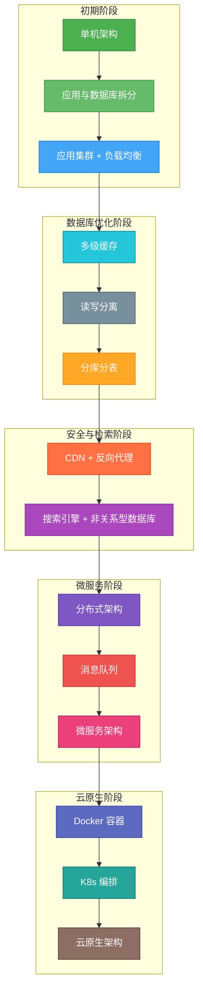

---

## 一、初期基础架构演进

### 1. 单机架构

网站初期用户少，把应用程序、数据库部署在同一台服务器，搭建简单、成本最低。

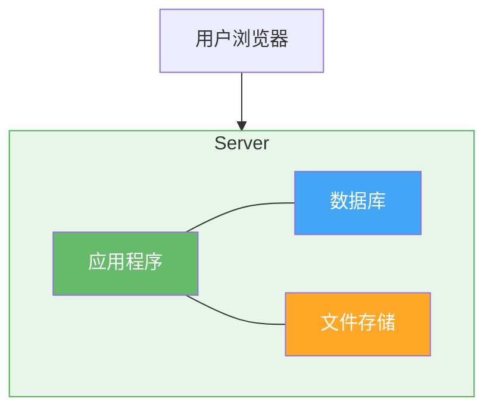

### 2. 应用与数据库拆分

用户增多后，单机资源争抢严重，拆分独立应用服务器、数据库服务器，各司其职，提升稳定性。

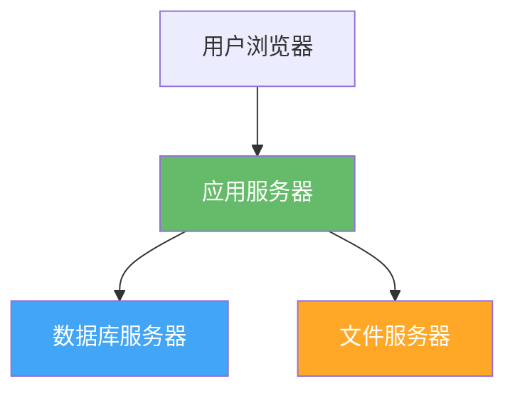

### 3. 应用集群 + 负载均衡

单台应用服务器扛不住高并发，多台服务器组成集群；通过负载均衡分配流量，实现水平扩展、故障自动屏蔽，保障高可用。

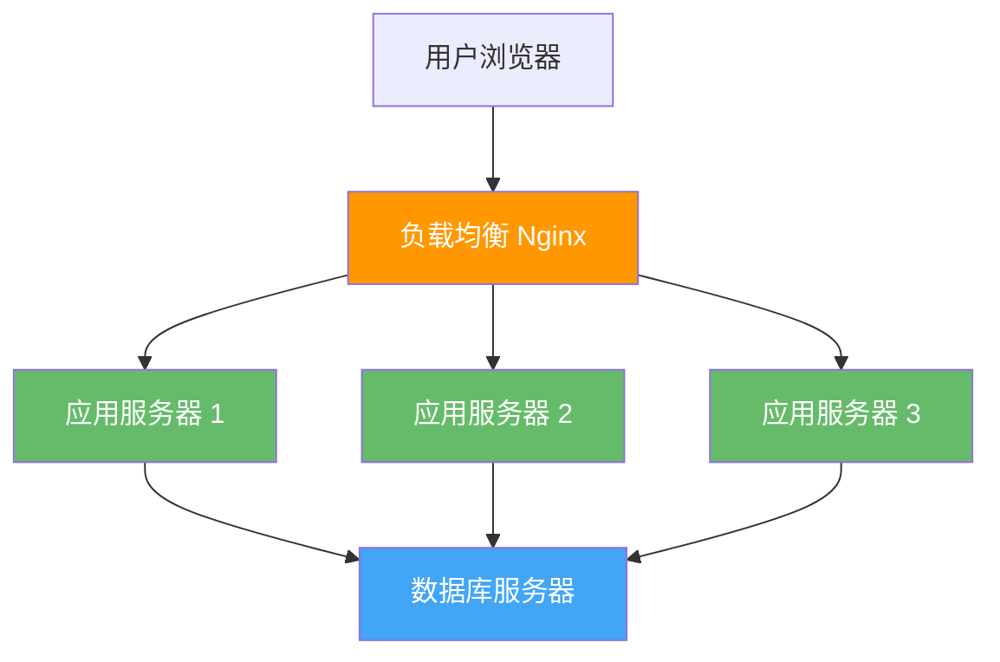

---

## 二、数据库性能优化阶段

### 1. 多级缓存

利用内存读写远快于磁盘的特点，搭建浏览器、本地、分布式三层缓存，拦截大部分查询请求，大幅降低数据库压力，提升响应速度。

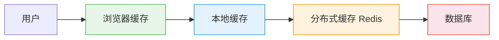

### 2. 读写分离

数据库写操作慢且易锁表，拆分主库负责写入、从库负责读取，适配互联网读多写少的特性，规避读写互相阻塞。

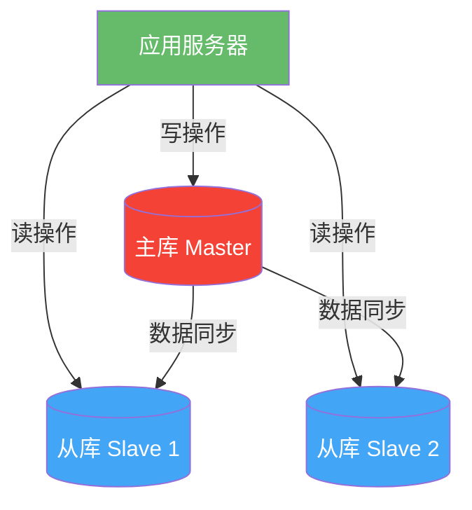

### 3. 分库分表

数据量暴增后，通过垂直分库按业务拆分成用户、商品、订单等独立库；通过水平分表把超大表拆分成多张小表，实现海量数据分布式存储。

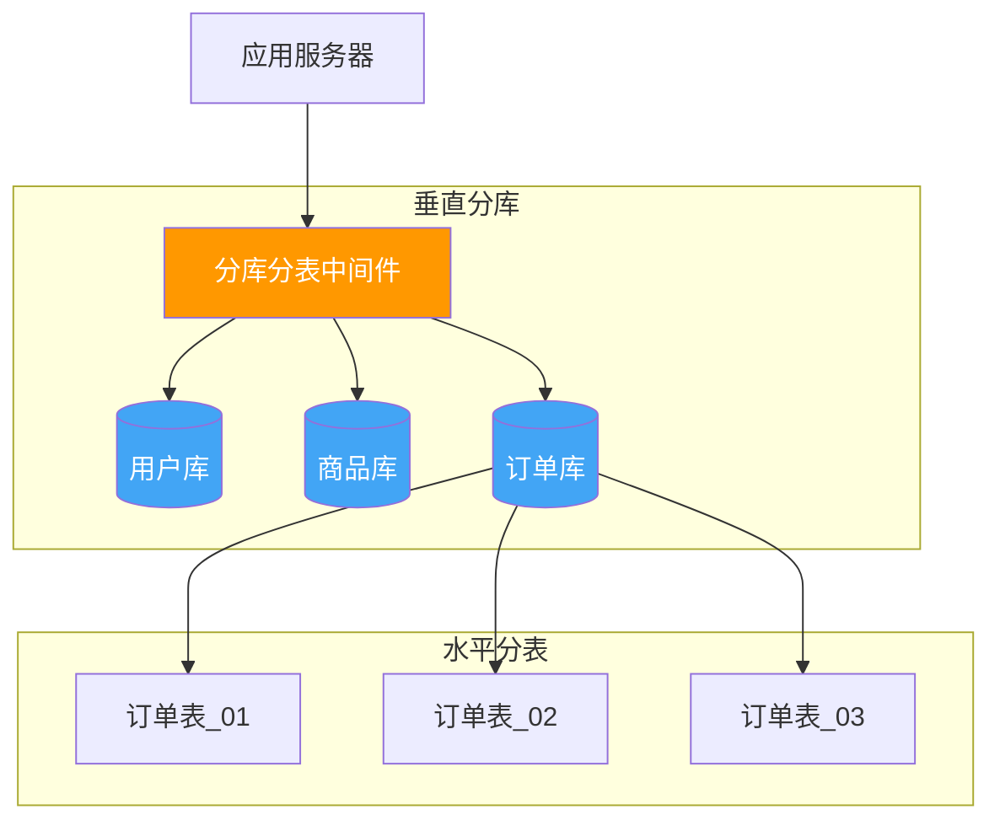

---

## 三、网络安全与检索能力升级

### 1. CDN + 反向代理

CDN 在全国布设节点，就近分发静态资源，提升异地用户访问速度；反向代理隐藏后端真实服务器，防护攻击、做流量与权限校验。

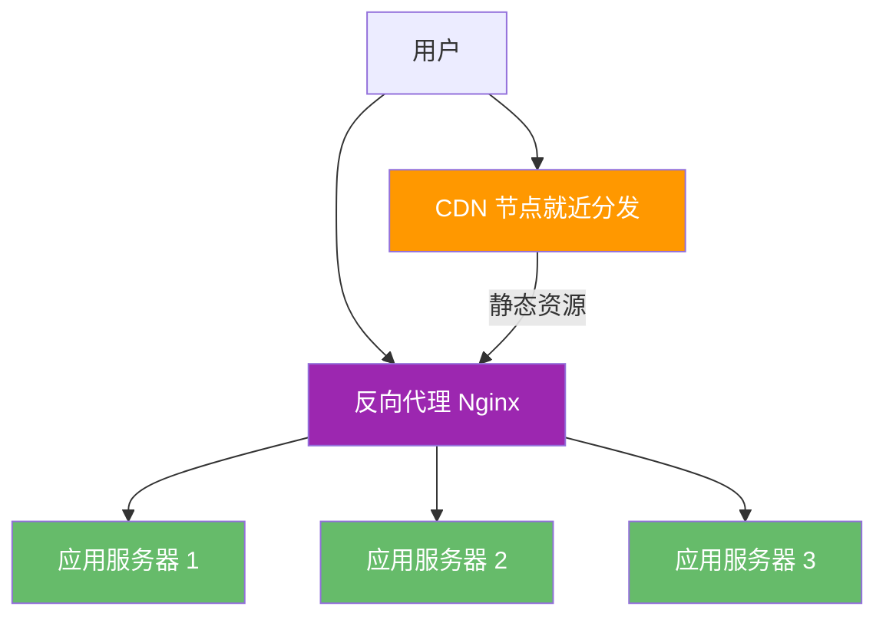

### 2. 搜索引擎 + 非关系型数据库

解决传统数据库模糊查询、全文检索、多维统计慢的问题，适配电商搜索、热搜等复杂业务场景，支持非结构化数据存储与高并发扩展。

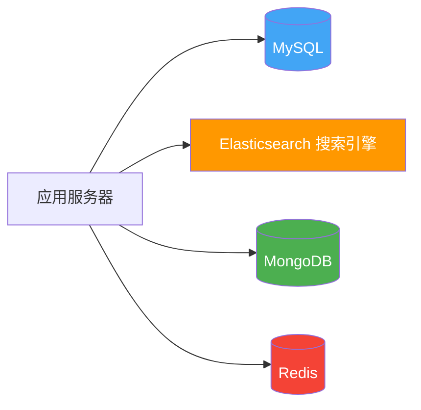

---

## 四、从单体到微服务架构

### 1. 分布式架构

把臃肿的单体应用拆分成独立子系统，单独部署扩容；引入 RPC 实现跨服务远程调用，搭配服务注册与发现中心，统一管理服务地址。

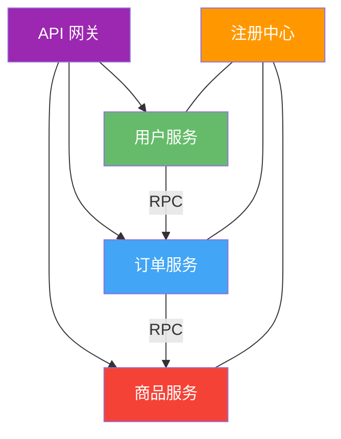

### 2. 消息队列

实现服务解耦，不用同步等待响应，还能削峰填谷，应对流量突增，服务宕机也不丢失消息。

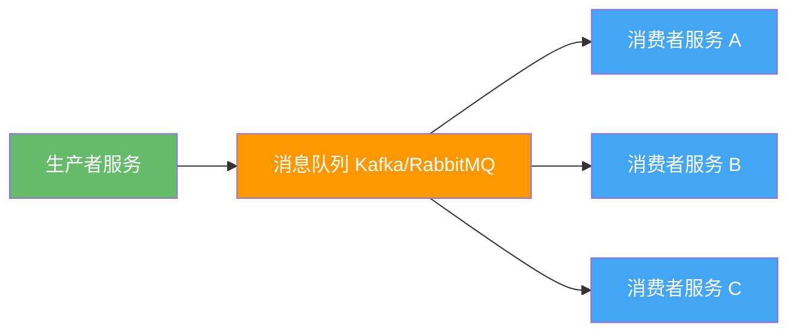

### 3. 微服务架构

进一步细拆功能为独立小服务，单一服务只做一件事，可独立开发、上线、扩容，适配不同技术栈，节省资源、降低故障影响范围；配套全链路追踪、限流熔断降级、服务治理，支撑千万甚至亿级流量。

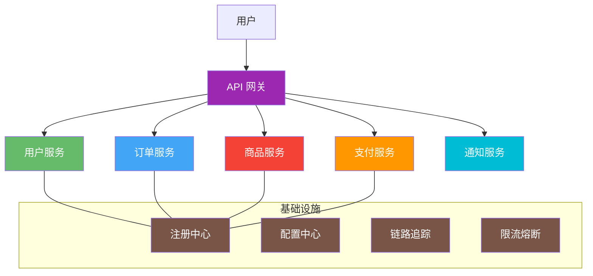

---

## 五、容器化与云原生时代

### 1. Docker 容器

将代码、依赖、运行环境打包成镜像，一次打包随处运行，解决开发与生产环境不一致的问题。

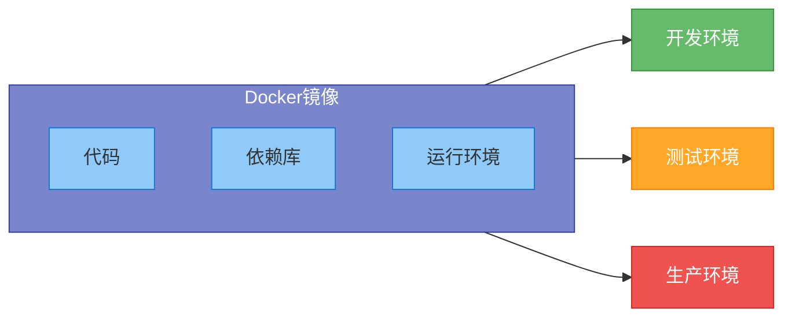

### 2. K8s 编排

统一管理大批量容器，实现自动扩缩容、故障自愈，降低人工运维成本。

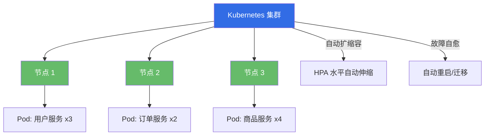

### 3. 云原生架构

依托云平台按需申领算力、内存、带宽，用完释放，无需自建机房囤服务器，实现资源弹性伸缩、自动化运维。

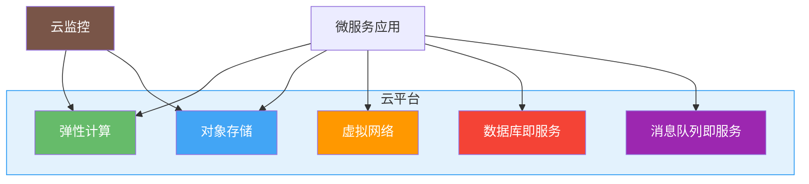

---

## 核心架构思维

1. **没有万能架构**，贴合业务阶段才最好，初创无需盲目上微服务；
2. **架构演进核心逻辑**：用空间换时间、用复杂度换性能；
3. **所有架构设计**，始终围绕高性能、高可用、可伸缩、可扩展、高安全五大目标。
