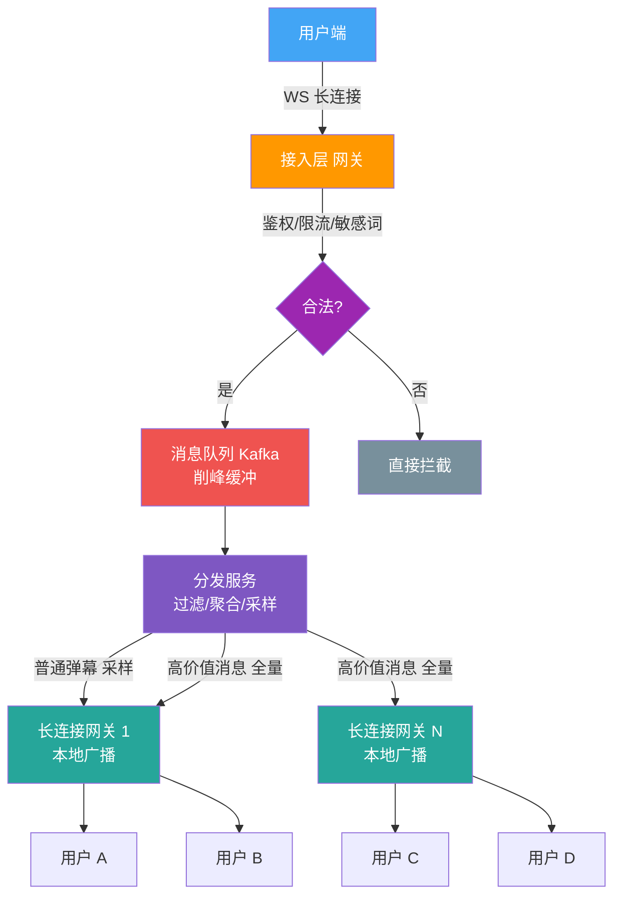
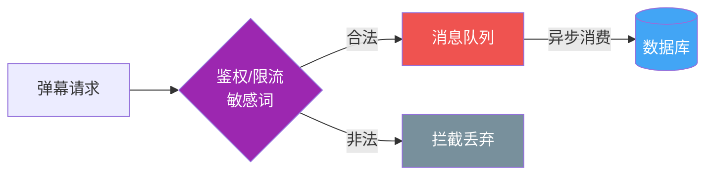
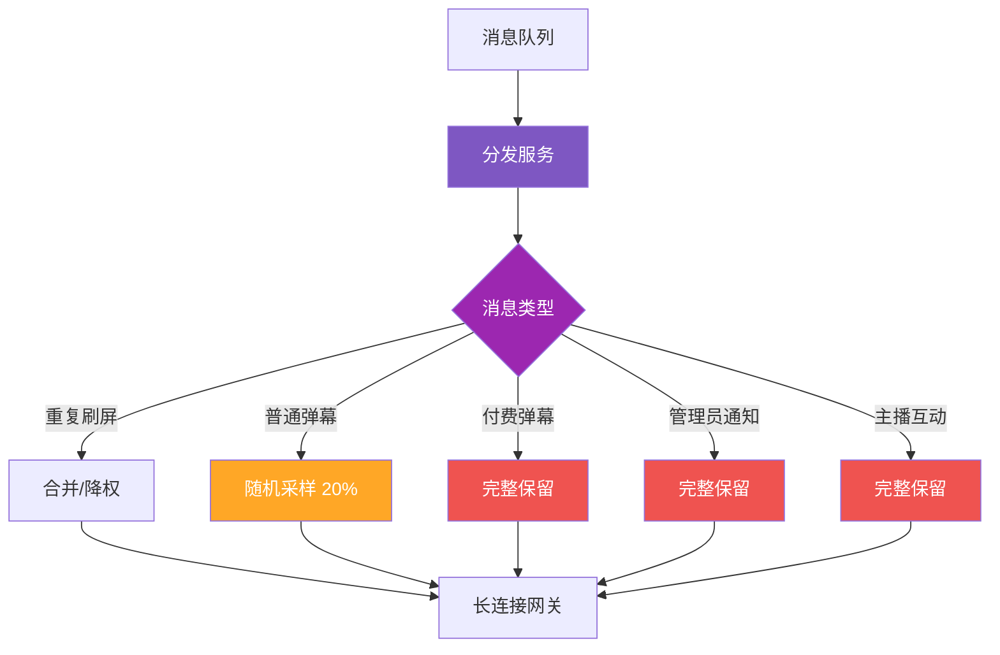
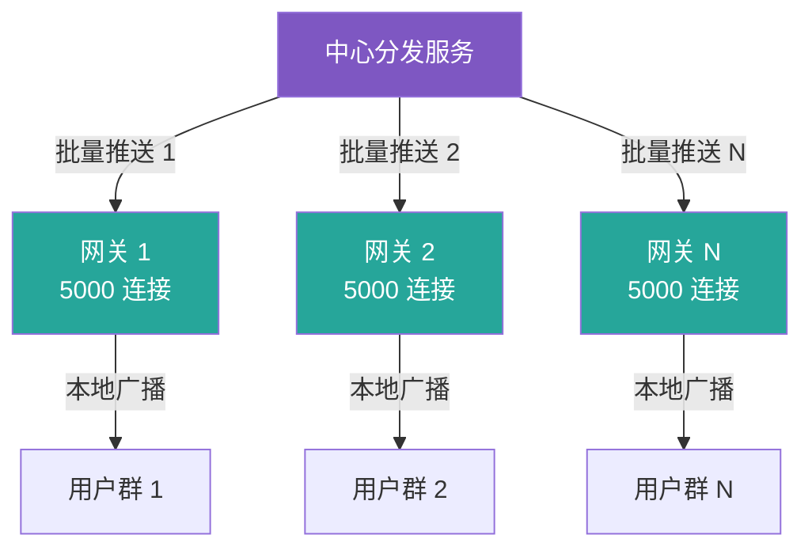
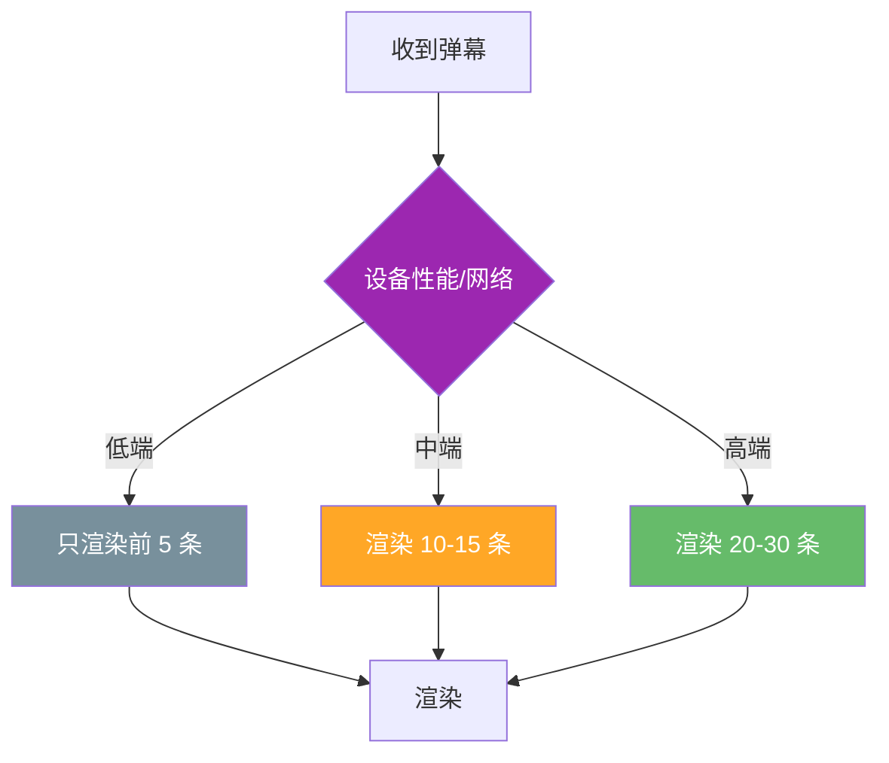

## 弹幕系统的核心思路

弹幕系统和 IM、Feed 流看着像，差异却很大：

| 维度 | IM (微信) | 弹幕 |
|---|---|---|
| 实时性 | 秒级可接受 | **百毫秒级** |
| 一致性 | **必须送达** | **允许丢失** |
| 历史消息 | 必看 | **不重要** |
| 核心目标 | 不丢不错 | **流畅、稳定** |

这种"允许丢、但要稳"的特性，决定了弹幕系统必须采用**有损服务**设计。

> 普通弹幕允许丢失、不全量送达，但必须保障系统整体稳定；高价值消息（付费、管理员、主播互动）单独走专属通道优先处理。整体围绕**削峰、分层、限流、多级降级**搭建高并发架构。

---

## 整体架构



四层结构：

1. **入口层**（网关）：限流、鉴权、敏感词
2. **消息层**（MQ）：削峰、缓冲
3. **处理层**（分发服务）：过滤、聚合、采样
4. **广播层**（长连接网关）：二级广播
5. **客户端**：兜底降级

---

## 一、入口层：限流 + 削峰

用户弹幕请求**先经过接入层**，完成：

- **鉴权**：登录态校验
- **禁言校验**：被禁言用户直接拦截
- **频率限制**：单用户每秒最多 N 条
- **敏感词过滤**：违规消息直接拦截

合法弹幕**写入消息队列**（Kafka / RocketMQ），**不直接同步写数据库**。

> 💡 为什么走 MQ 而不是直写 DB？
>
> 十万级直播间的瞬时弹幕峰值可达**几万 QPS**，直写 MySQL 会瞬间打爆连接池和磁盘 IO。MQ 作为**缓冲区**，把瞬时洪峰拉平成**后端能消化的稳态流量**。



**常见 MQ 选型**：

| MQ | 吞吐 | 延迟 | 适用场景 |
|---|---|---|---|
| **Kafka** | ⭐⭐⭐⭐⭐ | 中 | 日志、弹幕（高吞吐） |
| **RocketMQ** | ⭐⭐⭐⭐ | 低 | 金融、订单 |
| **Pulsar** | ⭐⭐⭐⭐ | 低 | 云原生 |

弹幕这种**对延迟敏感 + 高吞吐**的场景，**Kafka 是首选**，百万级 TPS 不是问题。

---

## 二、消息层：过滤 + 聚合 + 采样

分发服务从队列拉取消息后，**不会全量推送**：

| 消息类型 | 处理方式 |
|---|---|
| **重复刷屏**（同一用户相同内容） | 合并 / 降权 |
| **普通弹幕** | 随机采样（保留 20% 左右）|
| **付费弹幕（醒目留言）** | 完整保留、优先推送 |
| **管理员通知** | 完整保留、强制弹出 |
| **主播互动消息** | 完整保留、高亮显示 |



> 💡 为什么要采样？
>
> 人眼每秒能"看清"的弹幕约 **5-10 条**。即使你给用户推 1000 条，他**根本看不过来**。既然用户感知不到，不如在服务端就丢弃，省下来的带宽和渲染开销可以做更多事。

**采样策略**通常用**令牌桶 / 滑动窗口**：

- 每个房间 1 秒内最多推送 N 条
- 超出的弹幕进入降级队列（延后或丢弃）

---

## 三、分发层：二级广播

```
中心分发服务 → 多台长连接网关 → 本地广播
```

为什么不中心直推？

如果 10w 用户都在线，中心分发服务要给 10w 个连接各发一遍消息，**单机扛不住百万级下行流量**。

二级广播的好处：

| 角色 | 职责 | 数量 |
|---|---|---|
| **中心分发服务** | 把整理好的批量推给每台网关 | 少量（几十台）|
| **长连接网关** | 本地广播给维护的在线用户 | 多台（几百~几千台）|



假设：

- 1 台网关维护 **5000 个 WebSocket 连接**
- 10w 用户 → 需要 **20 台网关**
- 中心服务只需推 20 次，**不再是 10w 次**

> 💡 二级广播的本质：把"一对多"的压力，**沿网状拓扑分摊到边缘**。

---

## 四、客户端：兜底降级

终端设备**不会无脑接收渲染**弹幕，会根据**自身性能**动态调整：

- 低端机：只渲染前 5 条，丢弃后续
- 高性能设备：渲染 20-30 条
- 网络差：合并多条一起渲染，减少 DOM 操作



> 💡 客户端降级是最后一道防线。即使服务端漏过去 1000 条弹幕，**客户端也能自我保护**。

---

## 核心设计哲学

| 原则 | 体现 |
|---|---|
| **有损服务** | 普通弹幕可丢，业务目标不是 100% 送达 |
| **分层解耦** | 4 层各司其职，单层故障不蔓延 |
| **优先级** | 付费 > 管理 > 主播 > 普通 |
| **端到端降级** | 服务端 + 客户端双重兜底 |
| **削峰填谷** | MQ 缓冲瞬时洪峰 |
| **二级广播** | 拆分下行压力，规避百亿级流量 |

---

## 面试话术

> 弹幕系统本质是**有损服务 + 优先级队列**的设计。普通弹幕**采样推送**保证性能，高价值弹幕（付费/管理）**全量推送**保证业务。多级降级链路：入口限流 → MQ 削峰 → 采样合并 → 网关二级广播 → 客户端兜底。核心目标是**系统可用性 + 核心消息零降级**，而不是 100% 消息送达。

---

## 延伸思考

- **实时性怎么保证？** P99 延迟做到 200ms 以内怎么做？
- **长连接怎么保活？** WebSocket 心跳 + 重连机制
- **网关怎么水平扩展？** 一致性哈希做房间路由
- **弹幕数据怎么存？** 冷热分层（Redis 7天 + HDFS 归档）
- **敏感词过滤怎么做？** AC 自动机 + Trie 树，10w 词库性能如何？
- **如何防刷？** 设备指纹 + 行为分析 + 验证码三层
