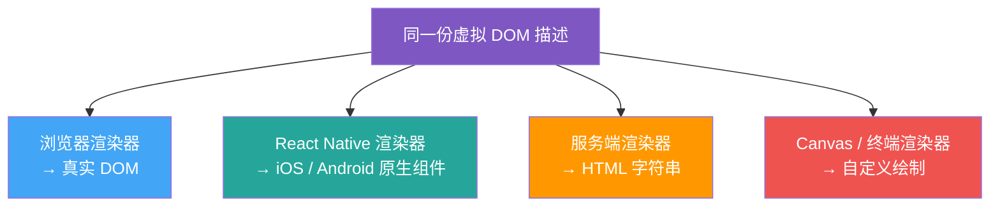
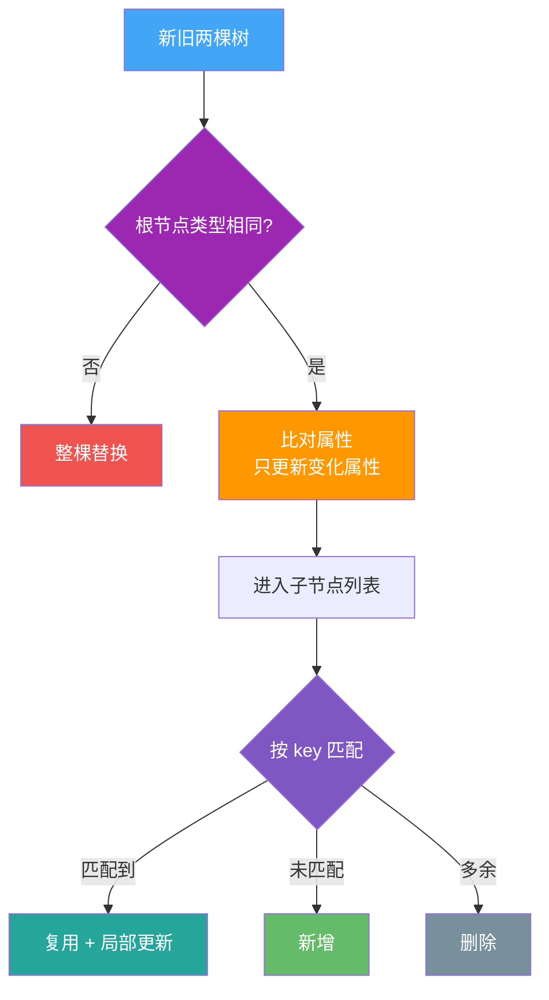

## 破除单一答案的局限

面试官问"为什么需要虚拟 DOM"，最常见的回答是：**为了解决真实 DOM 操作性能差**。

这句话没错，但只说了一半。它忽略了两个绕不开的追问：

1. **Svelte 没有虚拟 DOM，性能反而更好** —— 如果虚拟 DOM 纯粹是为性能而生，为什么无 VDOM 的方案更快？
2. **Vue 和 React 最终还是要操作真实 DOM**，多了"生成虚拟树 → diff → patch"这一整条链路，相当于在真实 DOM 之外多绕了一层，为什么还要用？

要答好这道题，得从**两个维度**讲：一是**组件级更新粒度**带来的开发效率收益，二是**UI 与运行环境解耦**带来的跨平台能力。

---

## 一、组件级更新：用一层抽象换开发效率

### 不同框架的更新粒度差异

| 框架 | 更新粒度 | 数据变化时的行为 |
|---|---|---|
| **Svelte** | 编译时精准绑定 | 编译器在构建阶段就把"哪个数据对应哪段 DOM"写死，运行时数据一变，直接改那一个节点 |
| **Vue / React** | 设计粒度只到组件 | 组件内任意数据变动，默认会触发整个组件函数/渲染函数重新执行，生成整棵组件子树 |

关键点在于：**Vue 和 React 的响应式系统，最小可追踪单位是"组件"，不是"DOM 节点"**。一个组件里哪怕只有一行文字变了，只要它触发了组件重渲染，组件内成百上千个节点理论上都要重新参与"这次渲染的产物"生成。

如果不做任何优化，最直接的方式是：**把组件返回的内容直接全量塞进真实 DOM**，那上千个没变化的节点也会被销毁重建，开销极大。

### 虚拟 DOM 怎么解决这个问题

虚拟 DOM 是一层用普通 JS 对象描述 UI 结构的轻量模型。数据更新后：

1. **生成新树**：组件重新执行，产出一棵全新的虚拟 DOM 树（纯 JS 对象，创建成本远低于真实 DOM）。
2. **diff 比对**：把新树和旧树做差异化比较，精准定位哪些节点真正变了。
3. **patch 打补丁**：只把变化的那部分，翻译成最少量的真实 DOM 操作（增/删/改）执行。

> 注意：虚拟 DOM 不是"比直接操作 DOM 快"，而是**在"组件级重渲染"这个前提下，把"全量重建真实 DOM"优化成了"最小量真实 DOM 操作"**。它优化的是框架自身的更新模型，而不是原生 DOM 本身。

### 那 Svelte 为什么更快

Svelte 走的是另一条路：**编译时优化**。它不在运行时维护虚拟树，而是在 `build` 阶段分析你的代码，直接生成"数据 → 具体 DOM 节点"的命令式更新代码。

| 维度 | Svelte（编译时） | Vue / React（运行时 + VDOM） |
|---|---|---|
| 运行时开销 | 几乎为零，直接改 DOM | 有虚拟树创建 + diff 成本 |
| 更新粒度 | 精确到单个节点 | 精确到组件，再靠 diff 细化 |
| 包体积 | 编译后代码小而直接 | 需要携带运行时 + diff 算法 |
| 开发心智 | 写起来像普通赋值，但灵活性受编译约束 | 心智模型统一，生态庞大 |

> 结论：Svelte 在**纯性能**上经常优于 VDOM 方案，这是事实。但 VDOM 框架用"运行时多一层抽象"换来了**统一的组件模型、庞大的生态、以及跨平台的基础**——这是性能之外的工程权衡。

---

## 二、跨平台：UI 描述与运行环境解耦

如果说"性能优化"是虚拟 DOM 的副产物，那**解耦**才是它更底层的价值。

### 问题：直接绑死真实 DOM 会怎样

如果框架的渲染逻辑直接依赖浏览器的 `document.createElement`、`appendChild`，那这套代码**只能在浏览器里跑**。你想把它用到：

- 手机 App（iOS / Android 原生组件）
- 桌面应用（Electron / Tauri 原生窗口）
- 服务端（把组件渲染成 HTML 字符串做 SSR）

每换一个环境，就得重写一套渲染层。

### 虚拟 DOM 的解法

虚拟 DOM 本质是一份**与平台无关的 UI 描述**（就是普通 JS 对象，描述"这里有个 div，里面有个 p，文字是 xxx"）。它本身不关心最终画在哪。

同一份虚拟 DOM 描述，配不同的"渲染器（renderer）"，就能产出不同平台的真实界面：

> 这就是为什么 React 能用同一套组件逻辑，既跑网页（React DOM）又跑手机（React Native）：底层只是把"虚拟 DOM → 真实 DOM"换成了"虚拟 DOM → 原生 UIView / View"。**虚拟 DOM 是那层通用的中间表示。**

### 对比：Svelte 的跨平台思路

Svelte 后来也做了跨平台（Svelte Native 基于 NativeScript），但它的重心仍在编译时输出。VDOM 框架则是**从架构第一性原理上就把"描述"和"绘制"分开了**，跨平台是天然属性，不需要为每个平台单独设计一套编译管线。

---

## 三、diff 算法的核心思想（面试深挖）

光说"有 diff"不够，面试官常追问：**怎么比？复杂度多少？**

React 的经典 diff 做了三个前提假设来把 O(n³) 降到 O(n)：

1. **跨层级的节点移动极少**：两个不同类型的元素会产生不同的树，整棵替换，不做跨层比对。
2. **用 key 标识同层节点**：同一层级的子节点列表，靠 `key` 判断是"同一个节点移动了"还是"新增/删除"，避免全量重建。
3. **同类型元素复用**：类型相同的节点，只更新变化的属性，不销毁重建。

> 关键点：`key` 的稳定性直接决定 diff 效率。用数组下标当 key，在列表增删时会导致错位复用，引发状态混乱和性能问题——**永远用唯一且稳定的业务 id 做 key**。

---

## 四、虚拟 DOM 不是银弹

把话说全，才显专业：

- **小页面直接操作 DOM 或 Svelte 编译方案可能更优**：VDOM 自己的创建 + diff 也有成本，节点极少时这层成本可能超过它省下的重绘开销。
- **VDOM 不能消除所有性能瓶颈**：它优化的是"更新的最小集合"，但如果你的组件本身就渲染了上万节点且频繁整体重渲染，问题在组件设计，不在 VDOM。
- **真正卡顿往往不在 diff，而在真实 DOM 的布局/绘制**：合理使用 `transform`、`will-change`、避免强制同步布局，比纠结 VDOM 更关键。

---

## 面试答题模板

> 虚拟 DOM 的核心价值有两点。第一，**在组件级更新模型下，它把"全量重建真实 DOM"优化成"最小量 DOM 操作"**，用运行时一层抽象大幅降低手写 diff 的开发成本、提升可维护性；Svelte 走编译时路线性能更好，但牺牲了部分灵活性和生态。第二，**虚拟 DOM 是一份与平台无关的 UI 描述**，把"UI 是什么"和"画在哪个环境"解耦，这是 React 能一套组件跑网页和原生 App 的底层基础。它不是为了让 DOM 变快，而是为了**开发效率和跨平台能力**。

---

## 延伸思考

- **Vue 3 的编译时优化**：Vue 3 在编译阶段就标记静态节点，跳过它们的 diff，是"运行时 VDOM + 编译时提示"的混合路线，比 Vue 2 快很多。
- **并发渲染（React Concurrent）**：虚拟 DOM 让"可中断、可恢复的渲染"成为可能—— Fiber 架构把渲染拆成小任务，优先响应用户输入。
- **SSR /  hydration**：同一份虚拟 DOM 描述，服务端渲染成 HTML 字符串，客户端再"激活"成可交互组件，首屏速度和 SEO 兼得。
- **如果让你设计一个无 VDOM 框架**：你会怎么在编译期捕获依赖关系？Svelte 的 `$:` 响应式和 Vue 的编译标记，思路有何异同？
