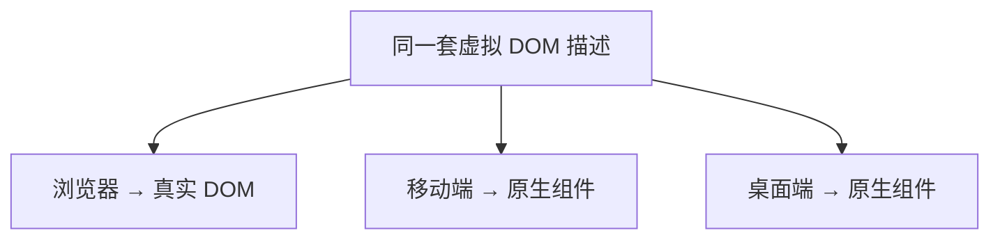

## 1️⃣ 破除单一答案的局限  
> **常见回答**：虚拟 DOM 只是为了解决真实 DOM 操作性能差。  
> 这句话虽然把核心概念写出来，却忽略了两大关键追问：

| 追问 | 关键点 |
|---|---|
| 1 | Svelte 没有虚拟 DOM，反而性能更好 | 需要说明框架更新粒度差异 |
| 2 | Vue/React 最终依旧要操作真实 DOM，多了虚拟 DOM 的对比、diff、patch 流程，相当于多绕一层，为什么还要用 | 这需要从“组件级更新”和“解耦”两个维度来答 |

---

## 2️⃣ 第一层核心原因 — 适配组件级更新，减少无效 DOM 操作  

### 2‑1. 不同框架的更新粒度存在区别  

| 框架 | 更新粒度 | 典型行为 |
|---|---|---|
| **Svelte** | 编译时精准绑定数据与对应 DOM 元素 | 数据变化只更新关联的那一小段 DOM，粒度极细，不需要虚拟 DOM |
| **Vue / React** | 设计粒度只能到组件 | 数据变动会触发整个组件重新渲染，若不做优化，组件内上千个 DOM 节点都会全量重绘，产生巨大损耗 |

### 2‑2. 虚拟 DOM 的优化逻辑  

用轻量 JS 对象模拟 DOM 结构（虚拟 DOM），数据更新后：
1. **生成新虚拟 DOM**：先生成一棵全新的虚拟 DOM 树。
2. **diff 算法**：通过对比新旧两棵虚拟 DOM，精准定位发生变化的节点。
3. **patch 算法**：只对变动部分操作真实 DOM，规避无关 DOM 的重复渲染。

### 2‑3. 性能客观对比  
原生 JS 直接操作 DOM、Svelte 无虚拟 DOM 方案，理论性能会更强；但 Vue/React 引入虚拟 DOM 是性能层面的“技术取舍”，核心收益是**大幅降低开发成本、提升开发效率**。

---

## 3️⃣ 第二层核心原因 — 实现 UI 与运行环境解耦，支撑跨平台  

1. **脱离环境依赖**：若框架直接绑定浏览器真实 DOM，代码只能运行在网页端，无法复用。
2. **抽象能力**：虚拟 DOM 本质是通用的 JS 对象，只负责统一描述 UI 结构，与运行环境无关。
3. **跨平台实现逻辑**：同一套虚拟 DOM 描述，在浏览器转换为真实 DOM，在移动端、桌面端可以转换为对应平台的原生组件，实现“一套代码，多端适配”。

---

## 4️⃣ 面试答题建议  

回答该问题时，建议完整覆盖以下两个逻辑点，能够体现你对底层原理的透彻理解，而非死记硬背：

### ✅ 核心答题模板
> **“虚拟 DOM 的价值在于：它在组件级提供了高效的差异化渲染方案，大幅降低了开发负担；同时，它作为一层通用的 UI 描述层，实现了 UI 与运行环境的解耦，为跨平台开发提供了可能。”**

### 💡 追问准备
- **如果面试官问 Svelte**：说明 Svelte 是在编译阶段就把更新逻辑写死了，粒度更细，但开发灵活性较低。
- **如果面试官问性能损耗**：承认虚拟 DOM 有额外的比对开销，但强调这一开销相对于“全量 DOM 操作”或“手动维护复杂 DOM 映射”来说是极小的。

---
