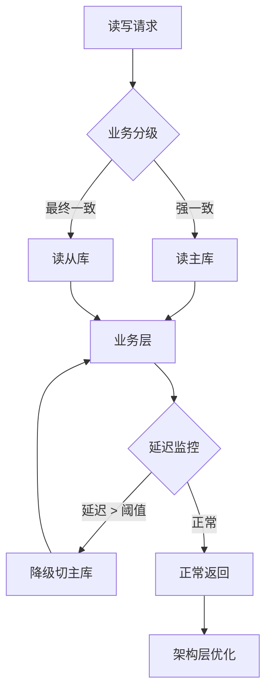
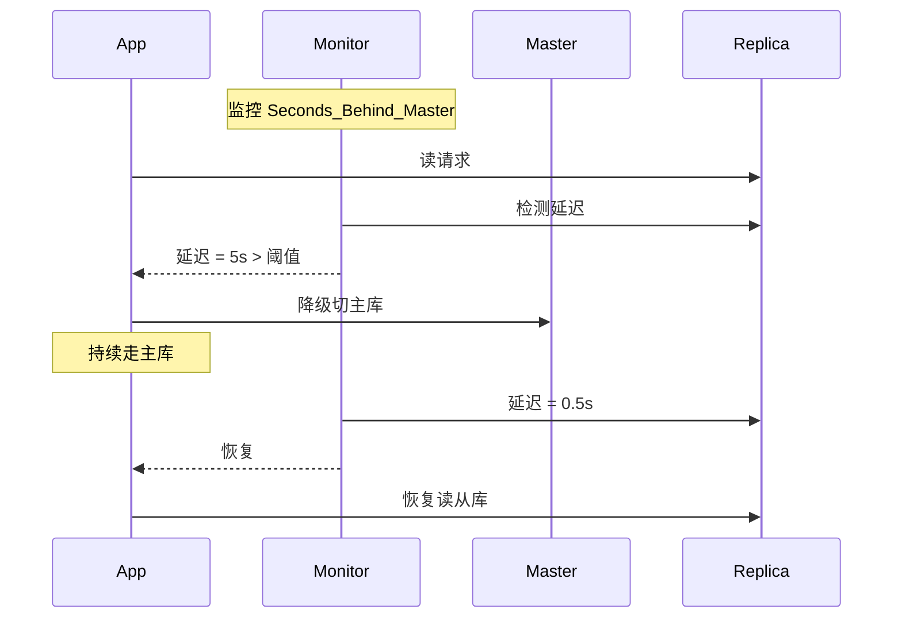

## 读写分离的面试分水岭

在后端面试里，读写分离是一道分水岭，能轻松区分只会背八股和真正懂实战的工程师。大部分求职者都能熟练背出标准答案：**主库承担写入，从库负责查询，拆分流量就能分摊数据库压力。**

可我只要抛出一个真实线上故障，就能立刻看出水平高低。

> 业务接入读写分离后，用户支付成功，订单数据写入主库，可跳转详情页却一直显示"待支付"，多次刷新都没有变化，导致大量用户投诉。去查库发现主库状态已是"已支付"，从库却没同步过来，依旧显示旧状态。

究竟出在哪里？很多人能答出**主从延迟**，可再问"如何保证刚写完的数据能立刻查到，难道全部读请求都走主库？"他们立马就答不上来，思路完全卡住。

这正是读写分离的**幽灵陷阱**——你以为加个从库就能解决读压力，却没想到主从延迟会让用户看到过期数据。

---

## 为什么这道题能筛出高手

它考察的不是**会不会配主从**，而是**有没有深入理解数据一致性在读写分离下的挑战**。

一个能真正驾驭读写分离的后端，必须建立**三层防御**。



---

## 第一层：业务分级 — 区分强一致性和最终一致性

这是最关键的设计：按业务场景区分读写路径。

### 强一致性读（强制读主库）

对于刚写入的数据，**强制读主库**：

- **下单成功后跳转的订单详情页** — 请求直接走主库查询
- **支付结果确认页** — 用户最关心的状态必须立刻看到
- **余额/钱包相关** — 写入后马上要看的数值

```sql
-- 强一致场景：直接查主库
SELECT * FROM orders WHERE order_id = ? /* + route to master */
```

### 最终一致性读（可以走从库）

对于**历史数据**、**报表查询**等可以接受短暂延迟的：

- **用户查看三个月前的订单** — 延迟几秒无所谓
- **历史账单列表** — 不影响用户体验
- **数据分析报表** — 本就是离线任务

```sql
-- 最终一致场景：走从库
SELECT * FROM orders WHERE user_id = ? AND created_at < ? /* route to replica */
```

---

## 第二层：读写分离的降级与兜底

当主从延迟发生时，必须有自动降级方案。

### 1. 延迟监控

监控主从延迟指标（`Seconds_Behind_Master`），如果延迟超过阈值（如 **3 秒**），**自动将读请求切回主库**，直到延迟恢复正常。



### 2. 版本号/时间戳校验

**写入时返回数据版本号或时间戳**（或 `last_modified_at`），读请求带上版本号，如果从库数据版本落后，**自动重试或切主库**。

```python
# 写主库后返回版本号
{
    "order_id": "123",
    "status": "paid",
    "version": 1736123456,
    "last_modified_at": "2026-07-07 12:30:56"
}

# 读请求校验
if replica_data.version < expected_version:
    fallback_to_master()
```

### 3. 本地缓存兜底

对热点数据在**应用层缓存几秒**，避免重复查库导致从库压力：

```python
# 缓存 2-3 秒的支付状态
@cache(ttl=2)
def get_order_status(order_id):
    return db.query("SELECT status FROM orders WHERE id = ?", order_id)
```

---

## 第三层：架构层优化 — 减少延迟窗口

### 1. 并行复制

开启 **MySQL 的并行复制**，提高从库同步速度，减少延迟。

```ini
# my.cnf (从库)
slave_parallel_workers = 8
slave_parallel_type = LOGICAL_CLOCK
```

### 2. 业务写后延迟

新写操作完成后，**业务线程 sleep 几十毫秒**，给主从同步留出时间。

这不是万能的，但对部分场景有效：

```python
def create_order(user_id, items):
    order_id = db.write("INSERT INTO orders ...")
    time.sleep(0.05)  # 50ms，让从库同步
    return order_id
```

### 3. 强制读主库开关

在业务关键链路设置开关 —— **大促期间所有读请求强制走主库**，宁可牺牲一点性能，也要保证一致性。

```yaml
# config.yaml
read_write_splitting:
  default: replica
  force_master_paths:
    - /api/order/detail
    - /api/payment/confirm
  force_master_periods:
    - "2026-11-11 00:00 - 2026-11-11 23:59"  # 双11
```

---

## 这道题考的是什么

| 层级 | 普通开发 | 高级工程师 |
|---|---|---|
| **配置层** | 会加从库分摊读压力 | 知道延迟是副作用 |
| **业务层** | 所有读都走从库 | 强一致/最终一致分流 |
| **降级层** | 出了问题再说 | 监控 + 自动降级 + 兜底 |
| **架构层** | 默认配置 | 并行复制 + 写后延迟 + 强制主库开关 |

**普通开发**以为读写分离就是加个从库，而**高级工程师**知道，在数据一致性面前，读写分离是一把双刃剑。

真正的工程思维，是从"配置驱动"升级到"**业务驱动 + 一致性设计**"。

---

## 面试回答模板

> 这道题我会从三层来回答：
>
> **第一层：业务分级**——强一致读主库（支付后跳转详情页），最终一致读从库（历史订单列表）。
>
> **第二层：降级兜底**——延迟监控 + 版本号校验 + 本地缓存，三道防线。
>
> **第三层：架构优化**——并行复制 + 业务写后延迟 + 大促强制主库开关。
>
> 读写分离不是简单的加从库，而是**数据一致性和性能的平衡**。